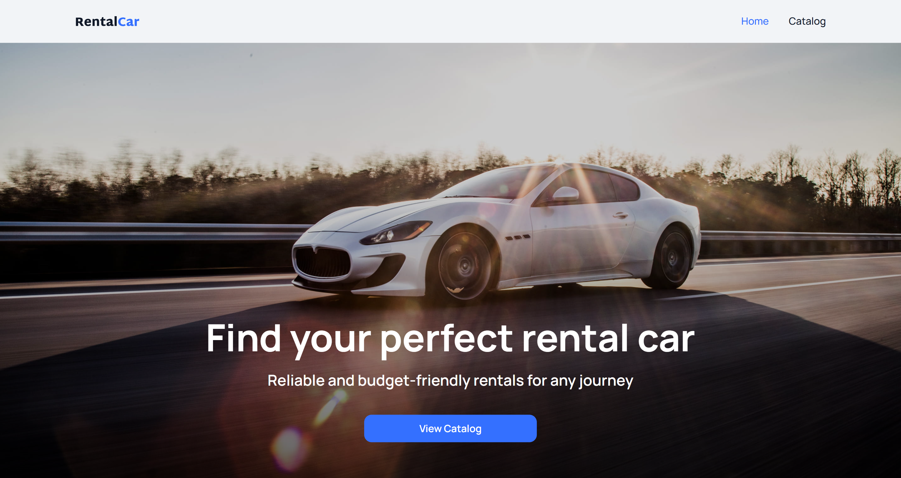
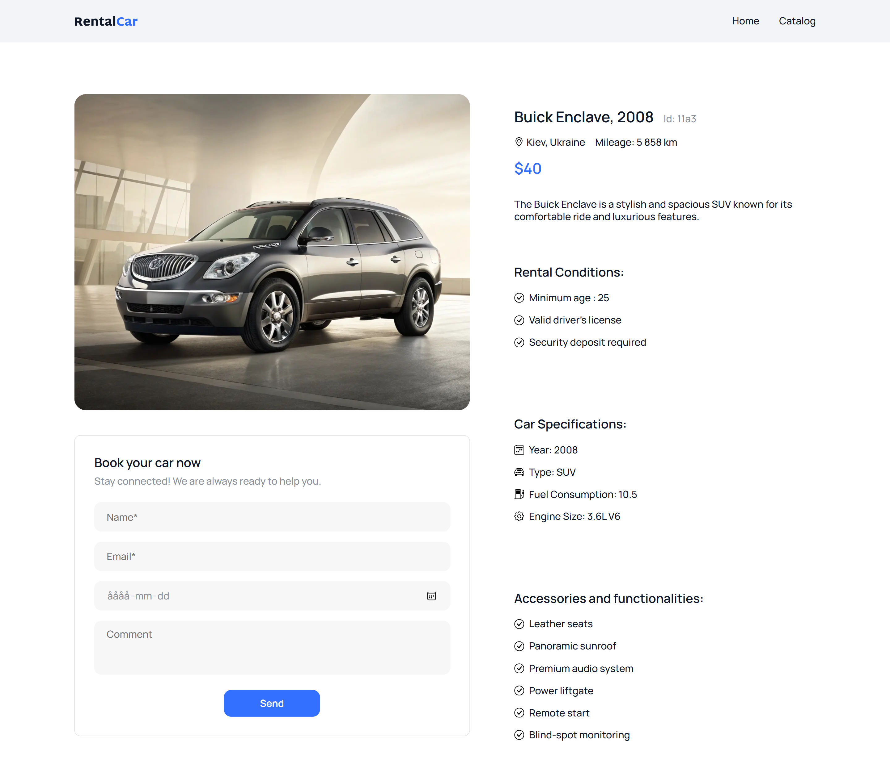

# Car Rental App 🚗

Frontend web application for browsing and renting cars.
The project allows users to view available vehicles, filter them by different criteria, add cars to favorites, and submit a rental request.

---

## Tech Stack


---

## Live Demo

Live page:
https://car-rental-app-pli7.vercel.app/

Repository:
https://github.com/alina-rybalchenko/car-rental-app

---

## Preview

Home • Catalog • Details

<p align="center">
  <a href="./public/images/readme/home.png">
    
  </a>
  <a href="./public/images/readme/catalog.png">
    
  </a>
  <a href="./public/images/readme/details.png">
    
  </a>
</p>

---

## Technologies Used

- **Next.js (App Router)**
- **TypeScript**
- **Axios**
- **Zustand**
- **CSS Modules**

---

## State Management

Zustand is used to manage:

- cars list
- filters
- favorites

---

## Features

- Home page with banner and call to action
- Catalog page with list of available cars
- Filtering cars by:
  - brand
  - price
  - mileage (from / to)
- Backend filtering via API
- Pagination with **Load More** button
- Add cars to favorites
- Favorites persist after page reload
- Car details page
- Rental form with success notification
- Loading indicators for async requests

---

## Project Structure

```sh
app
 ├ page.tsx
 ├ catalog
 │   ├ page.tsx
 │   └ [id]
 │       └ page.tsx

components
 ├ catalog
 ├ details
 ├ home
 └ shared

lib
 ├ api
 └ utils

store
 ├ carsStore.ts
 └ favoritesStore.ts

types
 ├ car.ts
 └ filters.ts

public
 ├ images
 │   ├ hero@1x.jpg
 │   └ hero@2x.jpg
 └ icons.svg
```

---

## 🔌 API

The application uses the provided backend API:

https://car-rental-api.goit.global/api-docs/

---

## Prerequisites

Make sure you have the following installed:

- Node.js (version 18 or higher)
- npm or yarn

---

## ⚙ Installation

Clone the repository:

```bash
git clone https://github.com/alina-rybalchenko/car-rental-app.git
```

Install dependencies:

```bash
npm install
```

Run the development server:

```bash
npm run dev
```

Open in browser:

```
http://localhost:3000
```

---

## Deployment

The application is deployed on **Vercel**.

---

## Author

Alina Rybalchenko

---
